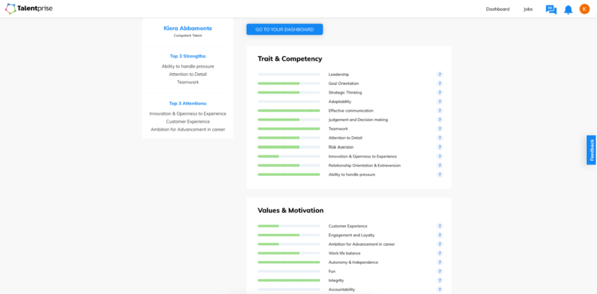

# AI Tools for Job Searching

A very crucial part of the recruiting process is finding the right job. With numerous platforms for companies to post jobs and the company's career pages themselves, it may seem like there are too many to choose from. In addition to this, it may be difficult to find exactly what you're looking for. The following three sections discuss some popular tools you can use to narrow your search and identify the best job for you!

## Talentprise

[Talentprise](https://www.talentprise.com/) is revolutionizing the way job seekers approach their career aspirations. In a world where standing out amidst a sea of applicants is increasingly challenging, Talentprise offers a dynamic platform that simplifies and invigorates the job search process. With a global reach, Talentprise empowers job seekers to expand their horizons, connecting them with coveted positions from local, regional, and international Fortune 500 companies. No longer confined by geographical limitations, candidates can showcase their unique value propositions and directly capture recruiters' attention. Uncover hidden job opportunities that align with your ambitions and secure the role you deserve.

In a landscape inundated with resumes and cover letters, Talentprise stands as a beacon of efficiency and innovation. By harnessing both qualitative data and the prowess of artificial intelligence, the platform empowers candidates to seamlessly rise above the competition.

Talentprise's comprehensive approach provides numerous advantages:

1\. **Personalized Insights**: Take an enlightening skills assessment that reveals your strengths and areas for growth in your job-seeking journey.

2\. **Total Privacy**: Retain control over your personal information, deciding who gains access to your profile and safeguarding the confidentiality of your job search.

3\. **Industry Intelligence**: Stay ahead of the curve by accessing key industry trends, enabling you to adapt and elevate your chances of securing your desired role.

4\. **Timely Notifications**: Never miss out on potential dream job opportunities

{width="445"}

{width="436"}

## Pyjama Jobs

[Pyjama Jobs](https://www.kickresume.com/pyjama-jobs/) is an innovative AI-driven platform that aims to streamline the job search process by connecting job seekers with suitable employment opportunities. By harnessing the capabilities of AI, Pyjama Jobs eliminates the need for exhaustive job searching and instead allows job seekers to be effortlessly discovered by recruiters based on their skills, qualifications, and preferences.

**1. Resume Creation and Upload:** Pyjama Jobs simplifies the initial step of job searching by offering users the choice to either create a resume using the platform's resume builder or upload an existing one from other sources. This feature ensures that job seekers present a comprehensive and accurate representation of their skills and experiences.

**2. AI-Driven Matching:** The heart of Pyjama Jobs' functionality lies in its AI-driven matching algorithm. Once a user's resume is uploaded, the platform's AI analyzes the document and cross-references it against an extensive database of job openings. This process enables both the job seeker and potential recruiters to swiftly determine if there is a suitable match.

**3. Tailored Job Offers:** Job seekers using Pyjama Jobs can expect a more personalized job search experience. Recruiters only make contact with candidates who are a strong fit for a specific position, saving both parties time and effort. This personalized approach enhances the overall quality of job offers received by candidates.

**5. Global Opportunities:** Pyjama Jobs goes beyond geographical limitations by enabling job seekers to apply for remote positions worldwide. This global reach increases the breadth of opportunities available to users and reflects the evolving nature of modern work arrangements.

**6. Comprehensive Job Information:** Each job post on Pyjama Jobs includes essential details such as salary ranges, providing job seekers with crucial insights to help them make informed decisions about potential opportunities.

{width="544"}
