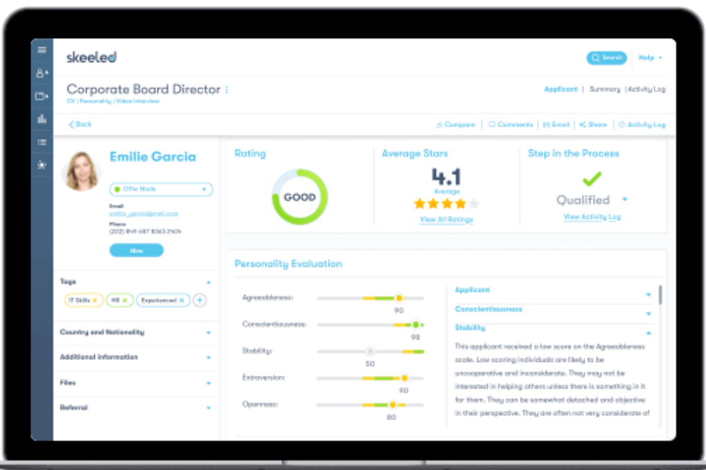
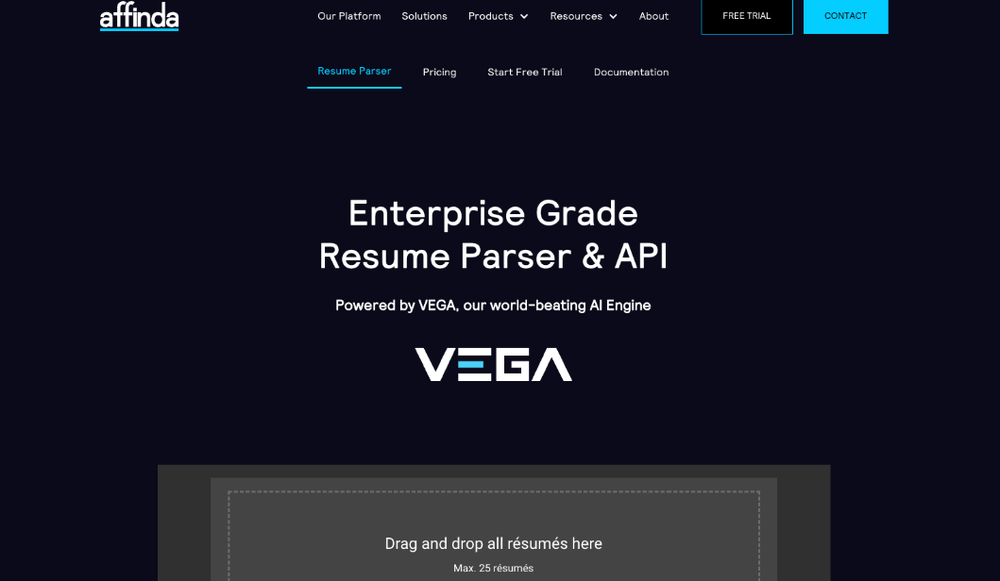

# Resume and Cover Letter Screening

With the rise of AI tools and an increasing number of people graduating from college, job openings are experiencing large numbers of applicants. This is especially true for established companies that students want to work at because of their large societal impact and safer job security. For example, popular tech companies like Google, Apple, and Amazon and consulting firms like Deloitte, McKinsey & Company, PwC, and EY have applicants from hundreds of colleges and universities and across the entire United States. To speed up the recruitment process, companies like these often use resume and cover letter screeners early on in their candidate selection process, so this chapter discusses how they use those tools and what students can do to better their chances.

## CVViZ

[CVViZ](https://cvviz.com/product/resume-screening/) is a groundbreaking AI tool designed to revolutionize resume screening for recruiters. Unlike conventional keyword searches, CVViZ employs contextual understanding to identify top candidates, learning from previous recruitment cycles to predict optimal matches. Its AI-driven approach eliminates the pitfalls of keyword mismatches, ensuring precise role differentiations. With CVViZ, recruiters can swiftly navigate through hundreds of resumes, leveraging its real-time relative ranking to pinpoint the best fits. Moreover, CVViZ seamlessly integrates with existing databases, enabling automated talent rediscovery for new job listings. 

{width="523"}

The above picture shows the management dashboard for the recruiter to track candidates with their contact information, generated grade, skill match, and status. The below picture shows an example of how the tool identifies a specific keyword such as "MySQL" in candidates' resumes.

{width="515"}

## Skeeled

[Skeeled](https://www.skeeled.com/services) transcends traditional resume screening by seamlessly integrating a sophisticated ranking algorithm. This proprietary technology enables a refined and efficient candidate evaluation process, aligning qualification indicators with organizational requirements to present a meticulously curated shortlist.

Skeeled's remarkable utility extends further, catering to the bespoke demands of each enterprise. By accommodating customizable criteria such as specific driver's license categories, work permits, and other specialized prerequisites, Skeeled ensures a comprehensive assessment tailored to individual company prerequisites.

{width="509"}

## Affinda

The standout feature of [Affinda](https://www.affinda.com/resume-parser)'s offering is its advanced resume parser, powered by the robust AI engine known as Vega. One of the key advantages of Affinda lies in its adaptability. The machine learning algorithms underpinning the parser continually evolve, ensuring that it can cater to a wide array of recruitment scenarios, no matter how unique or specialized they may be. Unlike traditional parsers that rely on rigid keyword or grammar-based rules, Affinda harnesses the power of Natural Language Processing (NLP) to comprehend words and phrases in a manner akin to human understanding. This intuitive approach enhances the accuracy and relevance of parsed data, enabling recruiters to make more informed decisions.

{width="378"}

## What You (A Student) Can Do!

Understanding what tools recruiters use to filter our candidates is the first step. By understanding the most popular tools, a few of which are referenced above, you can try to adjust your resume and cover letters to match what these tools search for and filter on. There are additional [recommended best practices](https://www.indeed.com/career-advice/resumes-cover-letters/resume-ai#:~:text=Instead%20of%20using%20a%20visual,this%20kind%20of%20complex%20information.) you can follow to ensure this step of the recruitment process is not where you fall out of the race with the company of your dreams:

-   Triple check (or even quadruple check!) that there are **no typos or mispelled words**. It\'s much easier for an AI tool to discover these errors than a human

-   Use a **traditional, standard, and clean** resume format

-   Make sure to **submit the correct file type** for your resume (usually specified in the job application) as some AI tools can only process certain file types

-   Avoid using a visual resume, especially for technical roles. Opt for **plain text and relatively basic formatting**

-   Make a thorough attempt to **add keywords** to your resume that were mentioned in the job posting as the AI tool will look for these

-   Include a **mix of hard and soft skills** to showcase your diverse skill set

-   **Traditional or usual resume advice still applies** to the resumes you submit to be analyzed by AI tools
