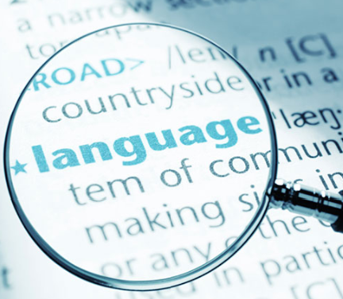

# Video Interview Assessments

One way that recruiters may also quicken the recruitment process is to use AI tools that analyze video interviews, whether self-recorded by the candidate or from an actual interview with employees from the company. More commonly, though, the video interview assessment that an AI conducts will be through a self-recorded interview the candidate will record on the employer's hiring platform. **Watch the following video for a concise summary of how AI can be used in the interview process!**

[The AI Video Interview](https://www.youtube.com/watch?v=cJkHft032OE)

## How it Works

It's important to note that the extent or amount of influence an AI tool will have will vary on the company. One company may not use AI tools at all to analyze a recorded interview video, whereas another company may use AI as a supplemental analysis to support decision making or just rely entirely on AI to filter out candidates.

In general, a video interview assessment entails a question being shown to the candidate, and then a brief period, usually around 30 seconds, for the candidate to prepare and formulate a response. Then, the tool will record the candidate's response (video and audio) for the allotted time for that question, which is usually just a few minutes. There may be an option to redo the video one time without a penalty, but don't rely on it as that is not always an option. Afterwards, the AI tool will create a report based on two main elements: **facial analysis** and **language analysis** (1). 

### Facial Analysis

Facial analysis will focus on the non-verbal aspect of the interview or how you conduct yourself during the recordings. This may include things such as **eye contact** with the camera, **eye wandering**, **lip position** and **movements**, **eyebrow movements** (furrowing and raising), **amount of smiling**, **chin raising**, and more (2).

{width="333"}

### Language Analysis

On the other hand, language analysis will focus on the content of your responses and the nature of your delivery. During or immediately after the recorded interview, the AI tool will convert your responses to text. Then, it'll parse through this and look for various things. From a content perspective, this may include the **technical language** and **vocabulary** you use that aligns with the job description and what the company is looking for (1). From a delivery perspective, this may include **active vs passive voice**, **run-on sentences**, the use of **filler words**, and the **tone** of your voice.

{width="208"}

## Benefits

AI-assessed interviews provide numerous benefits for both the recruiter and candidate:

-   **Recruiters**

    -   Allows the company to accept more applicants to the open position 

    -   Spend less money on employees to assess the video recordings

    -   Removes the bottleneck of screening the recordings by hand

-   **Candidates**

    -   While there is always a deadline, you can choose to do the recorded interview when it works best in your schedule

    -   More fair hiring process that isn't influenced as much by preconceptions and human biases and instead focuses more on qualifications

## Drawbacks

While AI-assessed interviews have its benefits, there are some significant drawbacks:

-   AI tools must be coded by humans in the first place, so there is no guarantee that the tool will be free of human biases

-   They may reinforce discriminatory practices such as penalizing someone with a strong accent or speed impediment

-   Human emotions and facial expressions are very complex and may not be interpreted correctly, which can inadvertently remove a qualified candidate from the selection process

-   Concerns regarding personal privacy and data security due to the large amounts of information being collected during the recordings

## What You (A Student) Can Do!

As a student preparing for the recruiting process this upcoming school year, you may be wondering how you can best set yourself up for success if you ever experience one of these AI interviews. **Look no further!** The following subsections highlight some tips and best practices.

### General Preparation

General preparation relates to activities and preparation work you should be doing prior to the interview to ensure your best prepared to answer the questions.

-   Research the company and general job type thoroughly in case of any questions related to why you want to work for the company or why you are applying to that positions

-   Prepare what you are going to say. Research some [commonly asked interview questions](https://www.themuse.com/advice/interview-questions-and-answers) and make sure you have a story bank of your past experiences that you can pull from and adjust based on the question asked

-   Practice using the [STAR (situation, task, action, result) method](https://www.themuse.com/advice/star-interview-method) as it's very popular framework for providing a response that is coherent, comprehensive, and insightful

### Countering the AI Tools

Countering the AI tools relates to what you should do during the interview based on what the AI tools are looking for and analyzing.

-   Practice talking to a camera and recording yourself so you get a good feel for where you're at and how to make progress (see Chapter 6: Student Practice Interviews)

-   Dress as if you were being interviewed by an actual interviewer in person

-   Clean the background of your recording space so the AI tool doesn't penalize you for a distracting background or make it harder for it to more accurately read your facial expressions

-   Ensure your lighting is good to allow for a proper facial analysis by the AI

-   Try to maintain eye contact with the camera as much as possible and use sticky notes on the computer/laptop if you want to refer to material

-   Keep your head high or at a neutral position; avoid angling your head downward

-   Smile and maintain a happy facial expression

-   Avoid the use of filler words like "um", "like", or "hmm"

-   Use keywords (skills and job duties) from the job description during your responses if you can

-   Speak clearly and loudly (more than usual) to ensure the AI tool can translate your verbal response into text

-   Try not to furrow your eyebrows as it can be interpreted as confusion, disapproval, or worry
